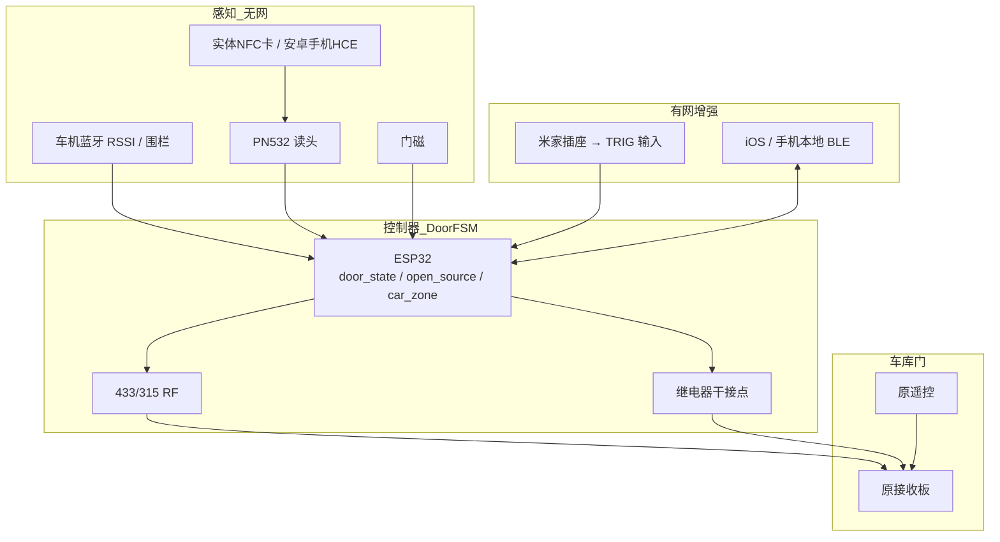

# 智能车库门控制器 · 商品化方案

> 定位：贴在电机旁的小盒子，**无网可用**；学习/对码后控制市面上大多数**国内传统卷帘门、电动车库门**。  
> **核心体验：车回自动开、车走自动关（仅系统开/确认无风险时）；手机 NFC 刷卡开关；有网可用米家插座语音控。** 原遥控零改动。

---

## 0. P0 原型当前实现状态

> 本文档描述**商品化目标**。当前 P0 原型固件已实现的功能与目标有差异，以本节为准。

### 已实现功能

| 功能 | 当前实现 | 与商品化目标差异 |
|------|----------|------------------|
| **跟踪模式** | BLE / 经典蓝牙二选一（网页切换，存 NVS） | 目标：自动识别或用户向导选择 |
| **BLE 模式开关门** | 无→有→强开，强→弱→无关（简化状态机） | 目标：渐变判定（GRADUAL_IN/OUT） |
| **经典蓝牙开关门** | 渐近开（RSSI≥-80），渐离+清空关 | 阈值写死，需实测标定 |
| **冷却保护** | 开门 5min / 关门 30s / 开后保持 15s | 目标：3min 开门冷却 |
| **手动开关** | 网页 / 串口 / 学习键 / TRIG（米家） | 已实现 |
| **Web 配置** | SoftAP 热点，手机浏览器配置 | 已实现 |
| **BLE 设备绑定** | 扫描任意 BLE 设备，点选绑定 | 已实现 |
| **经典蓝牙绑定** | 保存车机 MAC | 已实现 |

### 待实现功能（商品化版本）

| 功能 | 说明 | 优先级 |
|------|------|--------|
| **无感标定** | 日常使用自动学习 RSSI 阈值（见 §10.5） | P1 |
| **渐变判定（BLE）** | BLE 模式改用渐变逻辑，与经典蓝牙统一 | P1 |
| **门磁联锁** | 门磁参与自动开关判断，防砸车 | P1 |
| **NFC 刷卡** | PN532 + 实体卡/手机 HCE | P2 |
| **米家语音** | 有网增强，TRIG 已有基础 | P2 |
| **RF 发射** | 433/315 学习型，替代继电器干接点 | P1 |

### 当前 BLE 模式状态机（简化版）

```
WAIT（无信号）
  ↓ 出现弱信号（RSSI ≥ -110）
APPEARING（接近中）
  ↓ 信号变强（RSSI ≥ -80）
STRONG（车到位）→ 触发开门
  ↓ 信号变弱
LEAVING（车离开中）
  ↓ 信号消失（>15s 无匹配）
触发关门 → 回 WAIT
```

**限制**：
- 不判断渐变斜率，只看信号有无和强弱
- 门磁不参与判断
- 假设：车来门必关，车走门必开

### 当前参数（config.h）

```c
// BLE 模式
RSSI_APPEAR_MIN = -110    // 出现信号下限
RSSI_STRONG = -80         // 强信号阈值
BLE_SILENT_GAP_MS = 15000 // 无信号判定时间

// 经典蓝牙模式（待实测标定）
RSSI_OPEN = -80           // 开门阈值
RSSI_FADE = -90           // 渐离阈值
SLOPE_MIN = 0.6f          // 渐变斜率
T_CLEAR_MS = 100000       // 清空等待

// 冷却
AUTO_COOLDOWN_OPEN_MS = 300000   // 5 分钟
AUTO_COOLDOWN_CLOSE_MS = 30000   // 30 秒
AUTO_MIN_OPEN_HOLD_MS = 15000    // 15 秒
```

---

## 1. 商品定义

| 项 | 内容 |
|---|---|
| 产品名（建议） | 易控门 · 学习型车库门智能控制器 |
| 形态 | **双盒**：主控盒（库内靠门，远离电机）+ NFC 盒（库门外侧）；内置 RF 发射，**默认无继电器**；USB-C / 12V 供电。见 §4.1 |
| 核心功能 | ① 车接近自动开 ② 车离开自动关（有防误关规则）③ 手机/卡 NFC 开关 ④ 有网+米家插座语音 ⑤ 学习适配 ⑥ 原遥控可用 |
| 目标用户 | 有传统遥控卷帘门/电动车库门的家庭；安装商备件 |
| 不做什么 | 不承诺 Security+ 等加密滚动码；不依赖外网才能开关门 |

---

## 2. 从 DIY 到商品：必须解决的差异

你之前改造方案（可保留为技术内核）：

```
12V 常电 → 备用遥控电池仓
米家插座 USB → 5V 继电器 → 短接遥控按键焊盘
ESP32-C3 扫车机蓝牙 RSSI → 判断靠近
```

商品化必须补齐：

| DIY 痛点 | 商品解法 |
|---|---|
| 要拆一个遥控、焊按键 | 出厂内置 RF 发射 + 学习协议，用户「对码」即可，无需拆壳焊线 |
| 依赖米家插座做触发 | 本机 RF/继电器 + **NFC 卡本地触发**，无网也能开 |
| 蓝牙 RSSI 精度差、误开 | 围栏 + 车机蓝牙持续判定 + 门磁状态 + 冷却时间 四重防误 |
| 一款只适配自家门 | 学习流程产品化：拷贝码 / 接收机对码 / 干接点三模式 |
| 手机/小程序不在就废 | **PN532 刷卡主路径**，手机只作增强 |

---

## 3. 系统架构



---

## 3.1 核心功能逻辑（产品定义级）

### 需求对照

| # | 需求 | 实现摘要 |
|---|---|---|
| **F0** | **最高安全：车辆进出过程中绝不关门砸车** | 见「防砸车安全联锁」；未确认清空门洞前禁止发关门 |
| **F1a** | **仅蓝牙「渐近」才自动开** | RSSI 斜率持续为正 + 最终达阈值；**突然出现 → 不开** |
| **F2a** | **仅蓝牙「渐离」才自动关** | RSSI 斜率持续为负 + 长时间消失；**突然消失 → 不关** |
| F3 | 手动开 + 库内无车 → **禁止自动关** | `open_source` + `car_present` |
| F4 | 手机 NFC 开/关 | PN532 + 安卓 HCE / 实体卡 |
| F5 | 有网米家 | 智能插座 → TRIG |

### 状态量（固件必须持久化）

| 变量 | 含义 |
|---|---|
| `door_state` | 开 / 关 / 未知（门磁；无门磁则用动作后延时估计） |
| `open_source` | `AUTO`（接近自动开）/ `NFC` / `MIAO`（米家）/ `REMOTE`（原遥控，见下）/ `UNKNOWN` |
| `car_zone` | `OUT` / `NEAR` / `IN_GARAGE` / **`TRANSIT`** |
| `rssi_hist[]` | 滑动窗口 RSSI 采样（如最近 8–15 点，1s 一点） |
| `rssi_slope` | 窗口内线性斜率（dBm/s） |
| `signal_trend` | **`GRADUAL_IN` / `GRADUAL_OUT` / `STEADY` / `SUDDEN_APPEAR` / `SUDDEN_LOSS` / `UNKNOWN`** |
| `car_present` | 车是否在库内 |
| `last_bt_seen_ts` | 最近一次看到车机蓝牙的时间 |
| `doorway_clear_ts` | 判定「门洞已清空」的时间戳（F0 核心） |
| `last_action_ts` | 上次开/关时间，用于冷却 |

> **无门磁时**：无法区分原遥控开关。策略：原遥控开门后 `open_source=UNKNOWN`，自动关更保守（见下表）。

### 车位置与信号趋势（核心：只认渐变）

**产品铁律（你定的）：**

| 信号现象 | 趋势标签 | 系统动作 |
|---|---|---|
| RSSI **逐步变强**（连续多点斜率为正） | `GRADUAL_IN` | 允许评估 **自动开** |
| RSSI **逐步变弱**，随后长时间消失 | `GRADUAL_OUT` | 允许评估 **自动关**（仍须过 F0） |
| 原本看不到 → **瞬间很强** | `SUDDEN_APPEAR` | **不开、不关**，忽略本次 |
| 原本在 → **瞬间消失** | `SUDDEN_LOSS` | **不开、不关**，等是否恢复；关门资格从零算 |
| 信号稳定 | `STEADY` | 不改变开关决策 |

#### 滑动窗口与斜率

```
每 1s 采样一次车机 BT RSSI（仅目标 MAC）
窗口 W = 8～15 点（默认 10s）
rssi_slope = 线性回归斜率 (dBm/s)

GRADUAL_IN:
  连续 ≥ N_in 个窗口点可见
  AND rssi_slope ≥ +slope_min（默认 +0.5～1 dBm/s）
  AND 窗口末值 ≥ RSSI_OPEN（默认 -65～-55 dBm，现场标定）
  AND 最初出现点为「弱信号进入」而非「直接强信号」

GRADUAL_OUT:
  曾满足 IN_GARAGE
  AND rssi_slope ≤ -slope_min
  AND 窗口末值降至 RSSI_FADE（默认 -80 dBm 以下）
  随后进入「消失等待」：连续 T_clear 完全无 BT → 才允许关

SUDDEN_APPEAR:
  前一窗口几乎不可见（或间隔 > T_gap，如 10s）
  AND 本窗口直接 ≥ RSSI_OPEN（无渐强过程）
  → 标记，本次忽略；冷却后若仍强再按渐近重判

SUDDEN_LOSS:
  前一窗口稳定可见
  AND 本窗口连续丢包 ≥ T_loss_blip（如 3～5s）且无渐弱过程
  → 标记；禁止关门；等待是否恢复
  若恢复且未渐离 → 保持 IN_GARAGE，不动作
```

#### 状态映射

| 状态 | 条件 |
|---|---|
| `NEAR` | 可见但未达 RSSI_OPEN，或斜率未达标 |
| `IN_GARAGE` | `GRADUAL_IN` 达标并稳定若干秒 |
| `TRANSIT` | 门开 + 渐离过程中 / 突变后未确认 / 门开后 T_clear 内 |
| `OUT` | `GRADUAL_OUT` + 连续 T_clear 无 BT + 离开围栏 |

### 自动开（F1 / F1a）— 仅渐近

全部满足才开：

1. `door_state == 关`（无门磁则距上次动作 > 冷却）  
2. **`signal_trend == GRADUAL_IN`**（禁止 `SUDDEN_APPEAR`）  
3. `car_zone` 达到 `IN_GARAGE`（RSSI 达标 + 斜率达标）  
4. 冷却 ≥ 3min  
5. 非「仅手动模式」  

动作：RF/继电器 1s → `door_state=开`，`open_source=AUTO`。

**不开的情况：** 突然出现强信号、只有围栏没有 RSSI 渐强、斜率抖动、冷却中。

### F0 · 防砸车安全联锁（最高优先级，不可配置关闭）

**问题：** 卷帘门多为「一键点动/切换」，**发出去就很难中途反向**。一旦在车头/车尾还在门洞里时关门，就是砸车事故。因此 **自动关必须极度保守：宁可少关、永远不砸。**

#### 门洞通行态 `TRANSIT`

把「车在门洞里进出」单独成态，**任何自动关指令在 `TRANSIT` 下硬禁止**。

| 判定 | 条件（默认，可调阈值但不可删逻辑） |
|---|---|
| 进入 `TRANSIT` | ① 门为开 且 ② `GRADUAL_OUT` 进行中 / `SUDDEN_LOSS` 已标记 / 门开后 T_clear 未满 / RSSI 在门洞附近波动 |
| 保持 `TRANSIT` | 自 `last_bt_seen_ts` 起未满 **T_clear**（默认 90–120s）**或** 趋势仍非「稳定渐离完成」 |
| 退出 `TRANSIT` | 仅当：**已走完 `GRADUAL_OUT`** 且连续 **T_clear** 完全无 BT 且已离围栏 |

#### 自动关硬条件（全部满足才允许发关门脉冲）

```
door_state == 开
AND open_source 白名单（AUTO，或 NFC/MIAO 且曾 IN_GARAGE）
AND 曾经 GRADUAL_IN → IN_GARAGE
AND signal_trend 过程为 GRADUAL_OUT（禁止仅 SUDDEN_LOSS）
AND 已连续 T_clear 无任何车机 BT
AND 已离开地理围栏
AND door_state 仍 == 开
AND NOT TRANSIT
AND 冷却满足
AND （可选）对射无障碍
```

#### 硬禁止（任一命中 → 不发关门）

1. **`signal_trend == SUDDEN_LOSS`**（信号突然消失，不是渐离）  
2. **`car_zone == TRANSIT`**  
3. **`last_bt_seen_ts` 距今 < T_clear**  
4. 门刚开不久（`< T_min_open`）  
5. 车机 BT 重新出现（关前 abort）  
6. 无门磁且 `REMOTE/UNKNOWN`  
7. 用户「保持常开」

#### 门磁 / 可选安全件

| 件 | 作用 |
|---|---|
| 门磁（建议标配） | 知道门是否真的开着；关门命令发出前再确认一次 |
| 对射光电（可选 SKU） | **门洞被挡 = 硬件级禁止关门**；比 BT 更可靠 |
| 地磁/超声（二期） | 库内车位占用辅助 |

> 有对射时：光束遮挡 → 无论软件状态如何，继电器/RF 关门路径物理断开或固件拒绝执行。

#### 失败安全原则

- **不确定 → 不关**（保持门开，等下一轮或人工）  
- 关门前 500ms 再做一次 BT 扫描，命中则 abort  
- 文案/说明书必须写明：自动关为便利功能，**砸车风险由「宁可不关」策略兜底**；强烈建议加装门磁与对射  

### 自动关（F2 / F2a + F3）— 渐离 + F0 + 业务白名单

在 **渐离完成（非突变）且 F0 全部满足** 后，仍须：

1. **防误关白名单：**  
   - **(推荐)** `open_source == AUTO`  
   - 或 `open_source ∈ {NFC, MIAO}` 且曾 `GRADUAL_IN` 进库  
2. **显式禁止：**  
   - `open_source ∈ {REMOTE, UNKNOWN}` 且无车 → 不关  
   - `open_source == NFC` 且从未渐近进库 → 不关  

### 场景矩阵（验收用，含渐变 + 防砸车）

| 场景 | 信号 | 期望 |
|---|---|---|
| 车从远处开近，RSSI 逐步变强 | `GRADUAL_IN` | **自动开** |
| 蓝牙瞬间出现在门口强信号 | `SUDDEN_APPEAR` | **不开** |
| 车在库，RSSI 逐步变弱后消失 | `GRADUAL_OUT` + T_clear | **自动关** |
| 车机蓝牙突然断开（无渐弱） | `SUDDEN_LOSS` | **不关** |
| 渐离中途信号又恢复 | 抖动 | 保持开，重新累计 |
| 进库/出库门洞内 | `TRANSIT` | **绝不关** |
| 关门前 1s 又扫到 BT | 恢复 | **abort** |
| NFC 开门、无车 | 无 | 不关 |
| 原遥控开门、无车 | 无 | 不关 |
| 对射遮挡（若装） | — | 禁止关 |

---

### F4 · 手机 NFC 开关门

| 路径 | 说明 |
|---|---|
| **主** | 手机碰 **PN532**（安卓 HCE 写白卡 App，或系统 NFC 模拟；配对一次） |
| **标配** | 实体 NFC 卡/贴 ×2，与手机同一白名单逻辑 |
| 动作 | 门关→开；门开→可配置「再碰才关」或「仅开」 |
| 记录 | `open_source=NFC`；NFC 关门：`door_state=关`，清除 AUTO 离开判定 |

iOS 纯 HCE 受限：iOS 用户以实体卡 + 本地 BLE App 为主，文案写清。

### F5 · 有网 + 米家智能插座（可选配件）

不改原板、不要求控制器入米家：

```
小爱/米家 App
    → 智能插座「开」1 秒再关（场景）
    → 插座 USB 带 5V 继电器
    → 继电器短接控制器「TRIG 输入」干接点
    → 控制器执行与 NFC 相同的开关逻辑
```

- 包装可标「米家语音套装」：主机 + 插座 + 小继电器线  
- `open_source=MIAO`，防误关规则同 NFC  
- 无网时该路径失效，**不影响** NFC/自动/原遥控  

---

**三种适配模式（用户按自家门选一种）：**

| 模式 | 适用场景 | 操作 |
|---|---|---|
| A · 拷贝 | 固定码遥控（EV1527/PT2262 等） | 原遥控靠近控制器，按学习键，完成拷贝 |
| B · 对码 | 接收机有「学习/对码」键（你家那种板） | 控制器进入发码 → 按电机板学习键 → 完成 |
| C · 干接点 | 有墙控/OPEN-COM 端子的电机 | 继电器 NO/COM 并联端子，1 秒脉冲 |

> 商品话术：「90% 国内传统遥控门三种模式必中一种」——需用兼容实测表背书，不要写 100%。

---

## 4. 硬件方案（建议 BOM）

| 模块 | 型号建议 | 作用 | 参考成本 |
|---|---|---|---|
| MCU | ESP32-C3-MINI-1 或 ESP32-S3 | WiFi+BLE、协议学习、本地逻辑 | 8–15 元 |
| RF | CC1101 或 SX1278（315/433 双频） | 收固定码 + 发对码/拷贝码 | 8–18 元 |
| 继电器 | 1 路 5V/12V 光耦隔离 | **默认不配**；仅模式 C 干接点 SKU 选装 | 0–4 元（选装） |
| **TRIG 输入** | 光耦/干接点 | **米家插座路径：外部短接触发开关** | 1–2 元 |
| 门磁输入 | 干接点/光耦 | **F0/状态：强烈建议标配** | 1–2 元 |
| **对射光电（可选 SKU）** | 门洞对射 | **硬件级防砸车** | 5–15 元 |
| 供电 | USB-C 5V，可选 12V 版 | 家用/电机取电两版本 | 3–6 元 |
| 结构 | 阻燃 ABS 双盒 + 3M 贴/螺丝 | 主控：库内靠门；NFC：库门外。见 §4.1 | 8–15 元 |
| 天线 | 433 弹簧/外置 | 与接收板距离 | 1–2 元 |
| **NFC 读头** | **PN532（I2C/SPI）** | **无网刷卡/贴片开门**，装 **NFC 盒** | **3–6 元** |
| NFC 白卡/贴 ×2 | NTAG213 等 | 标配配件，可配对 | 1–2 元 |
| **整机物料** | | | **约 30–60 元** |

量产 1000 台目标：物料 ≤55，出厂价建议 99–149，终端 169–249。

**可选增强/套装：**
- 门窗传感器（强烈建议）→ 可靠 `door_state`，自动关更安全
- 米家智能插座 + 小继电器线 → 语音套装（见 3.1 F5）
- 光伏/电池版（无插座车库）二期
- 手机本地 BLE 开门（iOS 主路径）

---

## 4.1 外壳与结构设计（双盒）

> 商品形态：**内置 RF 发射芯片做对码/拷贝，不再拆原遥控、不再靠继电器短接按键**。  
> 默认 SKU **无继电器**；仅模式 C（干接点）选装继电器或外接干接点线束。

### 4.1.1 布局总览

```
库外                          │门体│                    库内（靠门，远离电机）
┌─────────────┐               │    │          ┌──────────────────────────┐
│  NFC 盒      │──短线穿门──▶│    │◀─────────│  主控盒                    │
│  PN532 读头  │  10–30cm     │    │  RF 空口  │  ESP32 + CC1101 + 电源     │
│  刷卡面朝外  │  I2C/SPI     │    │  433/315 │  门磁 / TRIG / 学习键      │
└─────────────┘               │    │          └──────────────────────────┘
```

| 盒 | 安装位置 | 装什么 |
|---|---|---|
| **主控盒** | 车库**内**、**靠近车库门**、**不靠近电机** | ESP32、RF、供电、门磁/TRIG 输入、学习键、状态灯 |
| **NFC 盒** | 车库**门外侧**（门框/门柱/门边固定件） | PN532 读头 + 天线线圈；刷卡面朝外 |

与旧 DIY「主机贴电机旁」不同：主控靠近门是为了缩短到 NFC 的线距、并让 BLE 更容易收到库外车辆信号；**电机侧只留 RF/干接点作用距离内的原接收板**。

### 4.1.2 主控盒尺寸

| 阶段 | 主要器件占地（约） | 盒内净空建议 | 市售壳参考 |
|---|---|---|---|
| **P0 原型** | ESP32 DevKit ~55×28 + 继电器模块（若仍用）+ 端子 | **≥90×55×25 mm**（含继电器则 ≥100×60×30） | 100×60×30 mm 或 110×70×35 mm |
| **商品** | ESP32-C3-MINI 小板 + CC1101 + 电源 + 端子 | **约 80×55×22**；端子/天线余量大则 **80×60×25** | 定制阻燃 ABS；兼容档 **70×50×20**（见下） |

- 商品化目标形态可收至方案原定的 **约 70×50×20 mm**，前提是：PCB 集成模组、端子改板边插针/线对板、433 用弹簧天线并预留净空。
- **DevKit + 成品继电器模块塞不进 70×50×20**，P0 一律按更大壳选型。
- 供电口（USB-C 或 5.5 端子）开在侧面；学习键、状态灯开在正面或侧面可操作处。
- 阻燃 ABS；安装：3M VHB 贴墙面/门侧壁，或 Φ3 螺丝 + 挂耳。**不要贴在会发热的电机壳体上**。

### 4.1.3 NFC 盒尺寸

| 项 | 建议 |
|---|---|
| 内部净空 | PN532 常见板 35×35～43×43 mm → 净空 **≥50×45×15 mm** |
| 壳体 | **60×50×20 mm**（够用）或 **70×70×20 mm**（手机刷卡更从容） |
| 前面板 | **仅塑料/亚克力**；禁止金属面板、金属漆、金属安装座压在天线线圈上 |
| 安装 | 3M 胶贴门框/门柱外侧，或薄底座+螺丝；刷卡中心高度便于车窗旁伸手碰到（常见 1.0–1.4 m，按车主习惯微调） |
| 防护 | 门外侧建议至少防泼溅结构（密封圈/百叶朝下）；不必 IP67 |

### 4.1.4 两盒互联

| 项 | 约定 |
|---|---|
| 距离 | 门厚 + 固定件，**通常 10–30 cm** |
| 线序 | I2C 最少四线：**3V3 / GND / SDA / SCL**；SPI 需 CS/RST 等，短距也行但没必要 |
| 线缆 | 1.0–1.25 mm² 多芯屏蔽线或普通排线即可；**&lt;50 cm 无长线协议问题** |
| 穿门 | 门框缝、门柱走线槽，或钻孔+护线圈；卷帘门活动帘片上**不走线** |
| 连接器 | 主控侧 2.54 插针或 XH2.54；NFC 侧可焊死或同规格，便于售后整盒更换 |
| 注意 | NFC 盒到主控**不要**贴着大面积金属门帘平行走线；短线垂直穿门即可 |

### 4.1.5 天线与金属门（结构约束）

金属卷帘/金属门会对 RF 造成明显影响，外壳与安装必须满足：

| 天线 | 约束 |
|---|---|
| **433/315 发射天线** | 离金属门面 **≥2–3 cm**；朝库内空旷方向；弹簧天线全伸出，勿塞在金属腔夹层 |
| **ESP32 BLE/WiFi 天线** | 天线侧勿紧贴卷帘门；盒体安装方向让 PCB 天线朝向车库开口或车辆驶入路径 |
| **PN532 线圈** | 仅贴塑料前盖外侧刷卡；线圈背面避免大面积金属背板 |
| 整机 | **禁用全金属外壳**（散热好但会毁掉 BLE/RF/NFC） |

**RSSI 重标定：** 阈值（如 `RSSI_OPEN`、`RSSI_FADE`）与盒子摆位绑定。主控从「随便放」改为「库内靠门固定」后，**必须按新安装位重做一轮现场标定**，不可沿用旧位置实测值。

### 4.1.6 散热

| 结论 | 说明 |
|---|---|
| **无需主动散热** | 商品无继电器、远离电机；整机峰值约 **0.3–0.8 W**（ESP32 联网/扫描峰值） |
| 密封塑料盒温升 | 通常 **&lt;10–15 °C**（相对环境），车库常温下裕量充足 |
| 仍需注意 | ① 浅色壳、避西晒；② 勿贴高温电机/排气侧；③ 12V 版用降压模块，勿用 LDO 长期扛压差发热 |
| 判断标准 | 若壳内长期 &gt;60 °C 或 ESP32 频繁掉线复位，再加大壳体/开散热孔；P0/商品默认不必 |

### 4.1.7 P0 采购清单（外壳）

| 件 | 规格建议 | 数量 |
|---|---|---|
| 主控防水盒（P0） | 约 **100×60×30 mm** 阻燃 ABS（含继电器时）；纯 RF 主控可试 **90×55×25 mm** | 1 |
| NFC 小盒 | 约 **60×50×20 mm**（或 70×70×20） | 1 |
| 多芯线 | 4 芯，长度 0.5 m 余量 | 1 |
| 护线格兰/胶圈 | 配合穿门孔 | 按需 |
| 3M VHB 或 M3 膨胀+挂耳 | 按墙面材质 | 按需 |

商品化再开模收小，不建议 P0 直接按 70×50×20 定制。

---

## 5. 「学习型」技术要点

### 5.1 固定码拷贝（模式 A）
- 监听 315/433 OOK，解析脉宽与地址/数据
- 常见：1527（24bit）、2262 及兼容、部分自定义
- 拷贝后本地重发；注意部分板是「学习固定码」，拷贝即可用

### 5.2 接收机对码（模式 B）
- 与市售「学习遥控」同理：控制器生成自身 ID，进入配对发射
- 用户按电机板「学习/对码」→ 板记下控制器
- **你家板就是这类**，是商品主路径

### 5.3 干接点脉冲（模式 C）
- 闭合 300–1000ms（可配置），模拟墙控
- 与门磁联锁：仅「门关」时允许自动开

### 5.4 覆盖边界（诚实宣传）
| 类型 | 能否适配 |
|---|---|
| 国内 433 固定码 / 学习码 | 高（主打） |
| 部分滚动码（需与接收机对码注册） | 中（对码成功则可） |
| 加密滚动码（Security+ 等） | 否（二期或不做） |
| 红外/其他频段 | 否 |

---

## 6. 米家 / 小爱（有网增强：智能插座，见 3.1 F5）

**主路径仍是无网本地（NFC / 自动 / 原遥控）。** 米家用**智能插座套装**，不要求主机认证：

```
小爱/米家 App
  → 米家智能插座（场景：开 1s 再关）
  → 插座 USB → 5V 小继电器
  → 短接控制器 TRIG 输入
  → 与 NFC 相同开关逻辑（open_source=MIAO）
```

| 项 | 说明 |
|---|---|
| 套装 SKU | 主机 + 米家插座 + 继电器线 + 说明书二维码场景教程 |
| 场景 | 「小爱，开车库门」→ 插座开 1 秒自动关 |
| 无网 | 该路径失效，其他路径不受影响 |
| 防误关 | MIAO 与 NFC 同规则；无车时禁止自动关 |

本地 BLE / 局域网仍作 iOS 与调试主路径。

---

## 7. NFC 控制（无网优先，需要 PN532）

### 7.1 结论：无网场景必须上控制器读头

| 方案 | 链路 | 无网能否用 | 问题 |
|---|---|---|---|
| 仅手机 NFC 贴纸 | 贴纸 → 手机自动化 → 再连控制器 | **不可靠** | 微信小程序要外网；iOS 快捷指令常要解锁+网络；手机不在/没电就废 |
| **控制器 + PN532 读头 + 配对卡** | **卡碰盒子 → 本机发码** | **可以，完全本地** | 物料 +3～6 元，体积略增 |
| 手机 NFC 当卡（HCE） | 手机碰读头 | **可以（安卓）** | 用户要的「手机刷 NFC」主路径；iOS 受限 |

**一期标配：PN532 + 2 张白卡；同时支持安卓手机 HCE 刷卡。**  
卡贴车内/钥匙扣；手机装一次 HCE 白卡即可「手机刷 NFC 开关门」。

### 7.2 产品体验

1. 开箱：学习键进配对 → 刷实体卡 / 安卓手机 → 绑定  
2. 可绑多卡 + 1～2 部手机  
3. 日常：碰读头 0.3s → 开或关  
4. 默认建议：**碰一下=开；再碰一下=关**（与需求 F4 一致，可改成仅开）

### 7.3 实现要点

| 项 | 建议 |
|---|---|
| 芯片 | PN532（I2C/SPI），兼容 NTAG213/215、Mifare Classic、部分手环 |
| 卡介质 | NTAG213 白卡/异形贴，成本低、手机也能写 |
| 鉴权 | 读 UID 白名单；可选扇区密钥（防简单复制） |
| 防重放 | 碰后冷却 10–30s；同一 UID 连续读只触发一次 |
| 配对 | 实体键进入配对 30s；长按清空全部卡 |
| 位置 | 读头装 **NFC 盒**（库门外侧），刷卡面朝外；主控在库内靠门，短线互联。见 **§4.1** |

### 7.4 与「手机碰贴纸」的关系

| 路径 | 定位 |
|---|---|
| **实体卡 / 安卓手机 HCE 碰 PN532** | **F4 主路径** |
| 本地 BLE App | iOS 主路径、参数配置 |
| 米家插座 TRIG | 有网语音（F5） |
| 手机 NFC 贴纸进小程序 | 不推荐作主路径（要网） |

### 7.5 防误碰

- 默认可设「只开不关」，防误把车关在外面  
- 复用冷却时间、门磁联锁（自动开时）  
- 未注册卡：LED 红闪 + 蜂鸣（可选），不动作  

---

## 8. 防误开 / 防砸车 / 防误关（与 3.1 对齐）

### 防误开
1. **仅 `GRADUAL_IN` 自动开；`SUDDEN_APPEAR` 一律忽略**  
2. 门磁=关才允许自动开  
3. RSSI 斜率 + 阈值 + 持续时间  
4. 冷却 3 分钟  
5. 手动优先：NFC、原遥控、TRIG  

### 防砸车（F0，最高优先级）
1. **`SUDDEN_LOSS` / `TRANSIT` / 未满 T_clear → 禁止一切自动关**  
2. **仅 `GRADUAL_OUT` 才有关门资格**  
3. 关门前再扫 BT，命中即 abort  
4. 门刚开 < T_min_open 不关  
5. 对射遮挡 → 禁止关  
6. **不确定 → 保持门开，永不砸车**  

### 防误关（F3）
1. 仅 AUTO（或确认渐近进库后渐离的 NFC/MIAO）  
2. REMOTE/UNKNOWN + 无车 → 不关  
3. NFC 开且从未渐近进库 → 不关  

---

---

## 9. 软件/固件模块

| 模块 | 职责 |
|---|---|
| **DoorFSM** | **F0 防砸车 + door_state / open_source / car_zone / TRANSIT / T_clear** |
| RF Learn / TX | 拷贝、对码、重发 |
| Relay | 干接点脉冲 |
| **NFC** | PN532、手机 HCE/卡白名单、开关动作 |
| **Proximity** | **RSSI 滑动窗口 + 斜率；GRADUAL_IN/OUT、SUDDEN_APPEAR/LOSS；关前 abort** |
| **TRIG In** | 米家插座路径输入 |
| Local BLE | iOS/安卓本地开关、参数 |
| Door State | 门磁滤波 |
| OTA | 有网升级 |

---

## 10. 用户开箱流程（转化关键）

1. 插电慢闪，**无需先连网**  
2. 学习键选 A/B/C 完成门适配  
3. 配对 NFC：实体卡 + 安卓手机刷读头  
4. 装门磁（强烈建议）；绑车机蓝牙 MAC + 调 RSSI/围栏  
5. 验证 F1 回家开、F2 车走关、F3 手动开无车不关  
6. （可选）米家插座套装接 TRIG，配小爱场景  

---

## 11. 合规与认证（国内售卖）

| 项目 | 说明 |
|---|---|
| SRRC | 433/315 发射设备，**必须**型号核准 |
| CCC | 电源适配器若含，整机一般 IT 类可走 |
| 质检/企标 | 电气安全、RF 参数 |
| 商标 | 建议注册中文商标 |
| 风险提示 | 说明书标明：自动开门责任自负、需门磁/确认场景；NFC 卡丢失可删除 |

---

## 10.5 无感标定（商品化版本实现）

> **当前 P0 原型不实现**，阈值写死在 `config.h`，手动调整。  
> 商品化版本（第二个 ESP32）实现此功能，让用户零配置自动适配。

### 设计目标

用户完成基础配置（选择功能模式 + 绑定车辆标识）后，系统在日常使用中**自动学习**信号特征，无需手动标定步骤。

### 前置条件

用户已在 Web/App 完成：
1. 选择跟踪模式（BLE / 经典蓝牙）
2. 绑定车辆标识（BLE 名称或经典蓝牙 MAC）
3. 启用车到开门、车走关门功能

### 学习数据采集

系统在以下事件自动记录 RSSI 数据（环形缓冲区，保留最近 N 条）：

| 事件 | 记录内容 | 用途 |
|------|----------|------|
| 自动开成功 | 开门前 5s 的 RSSI 序列 | 校准开门阈值 |
| 车在库内（门开状态） | 周期采样 RSSI | 建立库内 RSSI 基线 |
| 自动关成功 | 关门前 5s 的 RSSI 序列 | 校准关门条件 |
| 手动开关门 | 当时 RSSI | 补充样本（可选） |

### 阈值更新规则

**保守原则：宁可少开/少关，绝不误开/误关。**

```
开门阈值更新：
  收集 ≥ 5 次「自动开成功」样本
  取样本中位数 RSSI_median
  新阈值 = RSSI_median - 安全余量（如 5~10 dBm）
  → 阈值偏低，确保车确实到位才开

关门条件更新：
  收集 ≥ 5 次「自动关成功」样本
  分析关门时的信号特征（消失时长、斜率）
  确保关门条件足够保守
```

**更新频率限制**：
- 同一阈值最多每 24h 更新一次
- 连续 3 次更新变化 < 2 dBm → 认为已收敛，停止更新

### 存储结构（NVS）

```
cal_open_rssi     : 开门阈值（自动学习后覆盖默认值）
cal_fade_rssi     : 渐离阈值
cal_samples[]     : 最近 N 次样本（环形缓冲）
cal_sample_count  : 累计样本数
cal_last_update   : 上次更新时间戳
cal_converged     : 是否已收敛（bool）
```

### Web/App 展示

```
┌─────────────────────────────────────┐
│ 标定状态          已收敛 ✓          │
│ 开门阈值          -82 dBm（自动）    │
│ 关门弱信号        -91 dBm（自动）    │
│ 累计样本          47 次              │
│ 上次更新          2 天前             │
├─────────────────────────────────────┤
│ 当前 RSSI        -78                │
│ 信号趋势         渐近               │
└─────────────────────────────────────┘
```

用户可查看标定状态，但**无需手动操作**。若怀疑标定异常，可「重置标定」恢复默认值。

### 边界情况处理

| 情况 | 处理 |
|------|------|
| 换车/换车库 | 检测到长期无匹配 → 提示重新绑定，清空样本 |
| 信号环境变化（如加装金属门） | 样本中位数漂移超阈值 → 自动更新 |
| 恶意样本（故意干扰） | 取中位数而非均值，剔除极端值 |
| 冷启动（新设备） | 使用出厂默认阈值，随使用逐步学习 |

### 与手动标定的关系

商品化版本**只提供无感标定**，不提供手动标定向导：
- 降低用户学习成本
- 避免用户标定错误导致的安全问题
- 「重置标定」作为兜底，恢复出厂默认

---

## 11. MVP 路线图

| 阶段 | 内容 | 周期 |
|---|---|---|
| P0 原型 | B/C + PN532 + **渐变 RSSI（F1a/F2a）+ F0 防砸车**；阈值手动调整 | 2–4 周 |
| P1 学习版 | 拷贝 A；10 门兼容表；**渐开/渐关/突变忽略场景全绿**；**实现无感标定** | 4–6 周 |
| P2 完整体验 | 安卓 HCE、门磁、米家插座 TRIG 场景、iOS BLE | 4 周 |
| P3 小批量 | 结构、SRRC、100 台内测（跑场景矩阵） | 8–12 周 |
| P4 渠道 | 安装商/电商；套装 SKU | 持续 |

---

## 12. 定价与竞争

| 对比 | 市售拷贝遥控 | 市售 WiFi 车库控制器 | 本品 |
|---|---|---|---|
| 价格 | 10–30 | 80–200 | 169–249 |
| 学习适配 | 有（仅手持） | 部分 | 有（三模式） |
| **无网可用** | 是（手持） | **多半要网/App** | **是（NFC卡+本地BLE）** |
| 语音/远程 | 无 | 有（依赖网） | 有网增强 |
| 车靠近自动 | 无 | 少 | 有（本地判定） |
| **NFC 刷卡** | 无 | 少 | **标配读头+卡** |
| 原遥控 | 不影响 | 不影响 | 不影响 |

差异化：**「车回开/车走关（带防误关）+ 无网 NFC + 学习三模式」**，可选米家插座语音套装。

---

## 13. 风险

1. 学习码板型号杂，拷贝失败率 → 用模式 B/C 兜底 + 兼容表  
2. BLE RSSI 不稳 → 多条件与联，提供「仅刷卡/原遥控」降级  
3. 米家无正名 → 有网增强用插座/技能，**宣传不绑死米家**  
4. 自动开门责任 → 说明书 + 默认关闭自动开 + 门磁联锁  
5. NFC 卡被复制 → UID 白名单 + 可选密钥；丢失可在配对模式下删除  

---

## 14. 下一步（建议）

1. 确认 **渐变判定**：仅 `GRADUAL_IN` 开、仅 `GRADUAL_OUT` 关；**突变不动作**  
2. 确认 **F0 防砸车** 与场景矩阵  
3. 定 P0 硬件 + 门磁；现场标定 RSSI_OPEN / slope / T_clear  
4. 跑通：B 对码 + 渐开/渐关/突变忽略 + NFC + 米家插座  

---

*信号铁律：蓝牙渐近才开、渐离才关；突然出现/突然消失一律不动作。*
